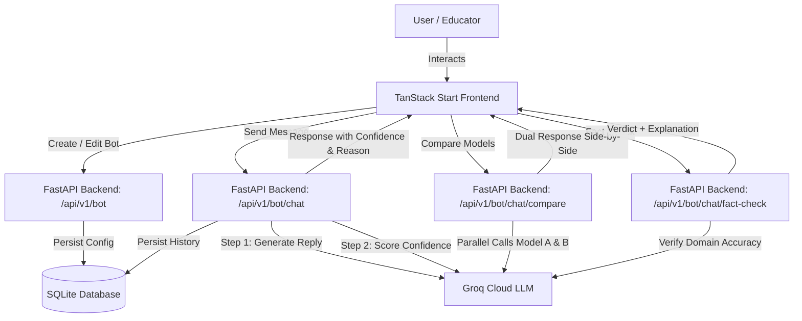

# QuillCraft: Complete Architecture, Technical Guide & Changelog

## 1. Executive Summary

**QuillCraft** is a fully functional, feature-complete prototype educational AI studio designed to give educators, curriculum designers, and students full control over creating, evaluating, and fine-tuning AI tutors. 

Unlike generic chatbots, QuillCraft implements a **rigorous pedagogical loop**:
1. **Dynamic Persona Synthesis**: Define role, personality, answering philosophy (*Hints-first* vs *Direct Answers*), and strict behavioral constraints.
2. **Dual-Stage Inference & Confidence Evaluation**: Every response is generated and then independently evaluated by an evaluator model on factual accuracy, style adherence, and clarity.
3. **Multi-Model Comparison Engine**: Educators can select any two models (e.g., `openai/gpt-oss-120b`, `llama-3.3-70b-versatile`, `qwen/qwen3.8-27b`) and compare their outputs side-by-side on the exact same student prompt.
4. **Automated Fact-Checking & Uncertainty Detection**: Responses scoring below 60% confidence automatically prompt the user to investigate why, triggering an instant factual breakdown.
5. **In-Session Improvement Detection**: Tracks iterative prompt and bot refinements in real-time, detecting $\ge 15\%$ confidence leaps on similar student questions.
6. **Mathematical & Scientific Formatting**: Full KaTeX math rendering (matrices, vectors, fractions, calculus notation) with syntax-highlighted code blocks.

---

## 2. Technical Stack

| Layer | Technologies / Libraries | Purpose |
| :--- | :--- | :--- |
| **Frontend Framework** | TanStack Start (SSR), React 19, Vite | Fast, typesafe full-stack rendering & routing |
| **Styling & Design System** | Tailwind CSS v4, Lucide React, Glassmorphism tokens | Elegant, responsive dark/light UI |
| **Animation & Micro-interactions** | Framer Motion | Smooth page transitions, ambient auras, collapsible panels |
| **Math & Code Rendering** | KaTeX, `remark-math`, `rehype-katex`, custom LaTeX preprocessor | Beautiful scientific and mathematical formulas |
| **Client State Management** | React Context + Custom Store Hook (`useQuillCraftStore`) | Active bot tracking, session history, version metrics |
| **Backend Framework** | FastAPI (Python 3.12+), Uvicorn | Async high-performance REST API |
| **LLM Provider** | Groq Cloud API (`groq` SDK) | Ultra-low-latency inference on open-weight foundation models |
| **Database & Persistence** | SQLite (`quillcraft.db`) | Relational persistence for bot configurations and messages |
| **Data Validation** | Pydantic v2 | Strict schema validation for requests, responses, and DB rows |

---

## 3. System Architecture & Pipelines



---

## 4. Key Pipelines & Engineering Details

### 4.1. Dynamic Bot Creation vs. Edit Separation
- **Problem Solved**: Previously, navigating from the Home page after chatting would mistakenly load the existing bot in "Edit" mode instead of offering a fresh creation canvas.
- **Solution**:
  - `isEditMode` is now strictly conditioned on `search.mode === "edit"` (validated via TanStack Router search params) and the presence of active bot credentials.
  - General navigation (Home buttons, navbar links, direct visits to `/build`) always open a clean, blank creation slate.
  - The Chat panel's **Edit Bot** button passes `search={{ mode: "edit" }}` to target the active bot.
  - A mode-switcher button in the `/build` header allows instantaneous toggling between "Create New Bot" and "Edit Active Bot".

### 4.2. Multi-Model Parallel Comparison Engine
- **Endpoint**: `POST /api/v1/bot/chat/compare` (also aliased at `/chat/compare`).
- **Models Available**:
  - `openai/gpt-oss-120b` (Flagship reasoning)
  - `llama-3.3-70b-versatile` (Fast, versatile open-weight foundation)
  - `qwen/qwen3.8-27b` (Alibaba high-accuracy reasoning model)
  - `openai/gpt-oss-20b` (Lightweight high-speed model)
  - `groq/compound-mini` (Compact inference)
- **Token Bounding & Rate-Limit Optimization**:
  - On Groq's on-demand tier, `qwen/qwen3.8-27b` enforces strict Output Tokens Per Minute (OTPM) constraints. Unbounded calls trigger HTTP 429 quota exhaustion.
  - The backend dynamically adjusts `max_tokens`:
    - For `qwen` models: capped at $\le 800$ tokens for responses and $\le 300$ tokens for confidence scoring.
    - Preserves ultra-fast parallel responses without hitting rate limits.
- **Side-by-Side Comparison UI**:
  - Dual responsive cards (Model A and Model B) with individual confidence scores, evaluator insights, and independent fact-checking triggers.
  - Swap button (`ArrowRightLeft`) allows switching Model A and Model B with one click.
  - Critical inquiry prompt beneath cards: *"Do these agree? If not, which one do you trust more, and why?"*

### 4.3. LaTeX & Mathematical Formatting Pipeline (`FormattedMessage.tsx`)
- **Problem Solved**: LLMs frequently emit mathematical formulas using various delimiter conventions (e.g., `(\vec v = \Delta\vec r / \Delta t)`, `\[...\]`, or `\(...\)`), which standard markdown renderers display as broken text and escaped backslashes.
- **Preprocessor Solution**:
  1. Identifies display math `\[ ... \]` and converts to `$$ ... $$`.
  2. Identifies inline math `\( ... \)` and converts to `$ ... $`.
  3. Identifies parenthesis-wrapped vector/calculus notations containing LaTeX primitives (`\vec`, `\Delta`, `\frac`, `\int`, `\alpha`, etc.) and converts them to math tokens.
  4. Passes preprocessed text through `remark-math` and `rehype-katex` with the imported KaTeX stylesheet.
  5. Wraps multi-line code blocks in custom styled containers with syntax badges and copy-to-clipboard functionality.

### 4.4. Automated Fact-Checking with Dynamic Verdicts
- **Endpoint**: `POST /api/v1/bot/chat/fact-check`.
- **Verdict Categorization**:
  - **Holds up**: Green badge, `CheckCircle2` icon.
  - **Partially accurate**: Amber badge, `AlertTriangle` icon.
  - **Inaccurate / Contested**: Rose badge, `AlertCircle` icon.
- **Uncertainty Trigger**:
  - If a response's confidence score falls below **60%**, a clickable warning appears:
    *"This seems uncertain. Want to investigate why?"*
  - Clicking this automatically runs the fact-check and expands the animated breakdown panel.

### 4.5. In-Session Iterative Improvement Detection
- **File**: `frontend/src/lib/session-improvement.ts`.
- **Behavior**:
  - Tracks student queries, bot version (`configVersion`), and confidence scores in memory.
  - When the bot is edited and a subsequent question has $\ge 80\%$ textual similarity (using Levenshtein similarity ratio), the system checks if confidence improved by $\ge 15$ points.
  - Triggers an immediate toast notification:
    *"Nice work refining that, tricky problems like this take iteration."*

---

## 5. API Reference

### 5.1. Bot Management
- `POST /api/v1/bot`
  - Body: `{ name: string, role: string, personality: string, answer_style: string, rules: string }`
  - Response: `{ bot_id: string, message: string }`
- `GET /api/v1/bot`
  - Response: List of all stored bots with timestamps.
- `GET /api/v1/bot/{bot_id}`
  - Response: Configuration of the requested bot.
- `PUT /api/v1/bot/{bot_id}`
  - Body: Updated bot configuration.
- `DELETE /api/v1/bot/{bot_id}`
  - Cascades and deletes bot along with associated chat history.

### 5.2. Chat & Evaluation
- `POST /api/v1/bot/chat`
  - Body: `{ bot_id: string, message: string, history: [{ role: string, content: string }] }`
  - Response: `{ reply: string, confidence: number, confidence_source: "ai" | "fallback_random", confidence_reason: string }`
- `POST /api/v1/bot/chat/compare`
  - Body: `{ bot_id: string, message: string, model_a?: string, model_b?: string }`
  - Response: `{ model_a: { name, reply, confidence, reason, error }, model_b: { name, reply, confidence, reason, error } }`
- `POST /api/v1/bot/chat/fact-check`
  - Body: `{ message_text: string }`
  - Response: `{ verdict: string, explanation: string, error?: boolean }`
- `DELETE /api/v1/bot/{bot_id}/messages`
  - Clears chat message history for the specific bot.

---

## 6. How to Run the Project

### Prerequisites
- Node.js (v18+) & npm
- Python (v3.11 or v3.12 recommended)
- Groq API Key (get from [console.groq.com](https://console.groq.com/))

### Step 1: Start Backend
```bash
cd backend
python -m venv .venv
# On Windows:
.venv\Scripts\activate
# On macOS/Linux:
source .venv/bin/activate

pip install -r requirements.txt
```
Ensure your `backend/.env` file contains your Groq API key:
```ini
GROQ_API_KEY=gsk_your_actual_groq_key_here
```
Run the FastAPI development server:
```bash
python -m uvicorn app.main:app --host 127.0.0.1 --port 8000 --reload
```
The backend API is accessible at `http://127.0.0.1:8000/docs` (Swagger UI).

### Step 2: Start Frontend
```bash
cd frontend
npm install
npm run dev
```
Open your browser at `http://localhost:8080/`.

---

## 7. Changelog & Project Evolution

| Feature / Issue | Early Project State | Current Updated State |
| :--- | :--- | :--- |
| **Model Selection in Compare** | Hardcoded models (`gpt-oss-120b` vs `llama-3.3-70b`) | Fully dynamic dropdowns supporting `qwen/qwen3.8-27b`, `gpt-oss-120b`, `llama-3.3-70b`, `gpt-oss-20b`, and `compound-mini` with instant swap button |
| **Groq Qwen Rate Limits** | Uncapped calls caused HTTP 429 errors on Qwen OTPM limits | Dynamic token capping ($\le 800$ tokens) ensures 100% reliable responses |
| **Mathematical Formulas** | Displayed raw backslashes and LaTeX code (e.g. `\(\vec v = ...\)`) | KaTeX rendered formulas with crisp mathematical notation and vector support |
| **Build vs. Edit Flow** | Always showed "Edit Bot" if a bot was loaded in store | Strict separation: Home & nav links always open "Create Bot"; only Chat "Edit Bot" triggers customize mode |
| **Evaluator Insights** | Displayed unstyled text `Score Reason: The reply accurately...` | Rendered as elegant "Evaluation Insight" cards with ambient icons and KaTeX support |
| **Fact-Check Experience** | Basic text box | Collapsible animated card with color-coded verdict badges (`Holds up`, `Partially accurate`, `Inaccurate`) and domain citations |
| **Low-Confidence Warning** | Static percentage badge | Automatic interactive trigger: scores $<60\%$ provide a one-click link to investigate why |
| **Mobile Responsiveness** | Fixed desktop sidebar | Responsive slide-out drawer with backdrop blur and touch dismiss |
| **Hydration Determinism** | Random coordinates caused SSR hydration warnings on Home | Deterministic pseudo-random generation ensuring zero hydration errors |
| **Hallucination Audit Mode** | No stress testing capability | On-demand toggle injecting an audit directive to test bot boundary resistance; student refusal rules strictly take top priority before generating plausible fiction |
| **Model Dropdowns & Theme Contrast** | Native browser `<select>` with unstyled options and contrast clashes on hover | Sleek Radix UI Select components with neutral high-contrast hover highlights in both Light and Dark modes |
