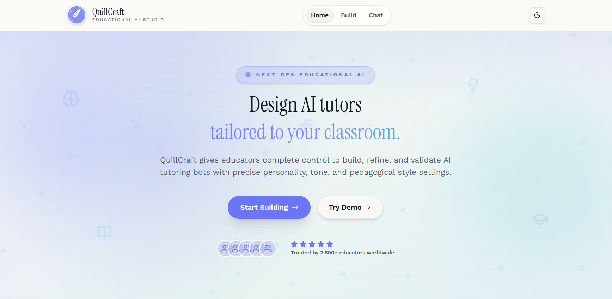
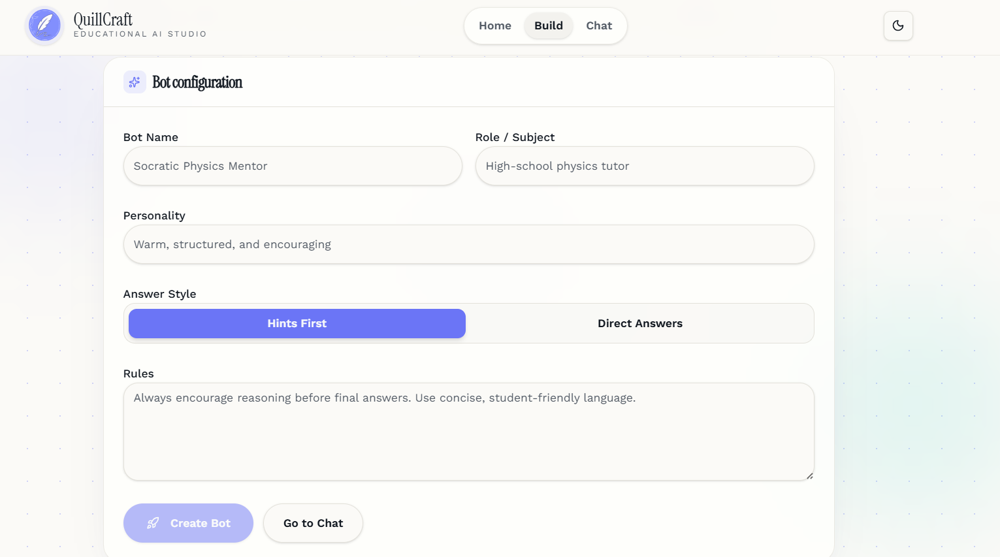
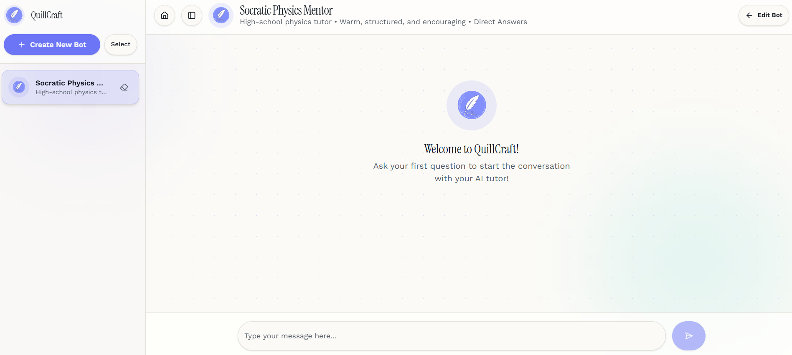

# QuillCraft

QuillCraft is a full-stack educational AI workspace for designing, testing, and refining tutoring bots. The frontend is built with TanStack Start and Vite, while the backend is a FastAPI service that manages bots, chat interactions, and persistence.

## What it does

- Build a tutoring bot with a subject, role, personality, answer style, and custom rules.
- Test the bot in a chat UI with message history and confidence indicators.
- Browse saved bots, switch between them, and clear or delete conversations.
- Present the project with a polished landing page and screenshots.

## Project Structure

- `backend/` - FastAPI app, database layer, Groq integration, and API routes.
- `frontend/` - TanStack Start application, UI components, routes, and client helpers.
- `frontend/public/` - Static assets used by the site, including screenshots.

## Screenshots

The following screenshots are stored in the public folder and shown on the home page.

### Home



### Bot Builder



### Chat



## Frontend Setup

```bash
cd frontend
npm install
npm run dev
```

Available scripts:

- `npm run dev` - start the development server.
- `npm run build` - create a production build.
- `npm run preview` - preview the production build locally.
- `npm run lint` - run ESLint.
- `npm run format` - format the codebase with Prettier.

## Backend Setup

```bash
cd backend
pip install -r requirements.txt
uvicorn app.main:app --reload
```

The backend exposes the API used by the frontend chat and bot builder flows.

## Environment Variables

Frontend:

- `VITE_API_BASE_URL` - optional override for the backend API base URL. Defaults to `http://127.0.0.1:8000`.

Backend:

- Refer to the backend service code for any API keys or database settings required by the local environment.

## Key Features

- AI tutor creation and editing
- Chat-based bot testing
- Persistent bot storage
- Confidence display for responses
- Responsive marketing homepage
- Screenshot gallery for the public assets

## Built By

Built by Abdullah Siddique.

- GitHub: https://github.com/abdullah90907/QuillCraft
- LinkedIn: https://www.linkedin.com/in/mr-abdullah-siddique/
- Website: https://abdullahsiddique.co.uk
